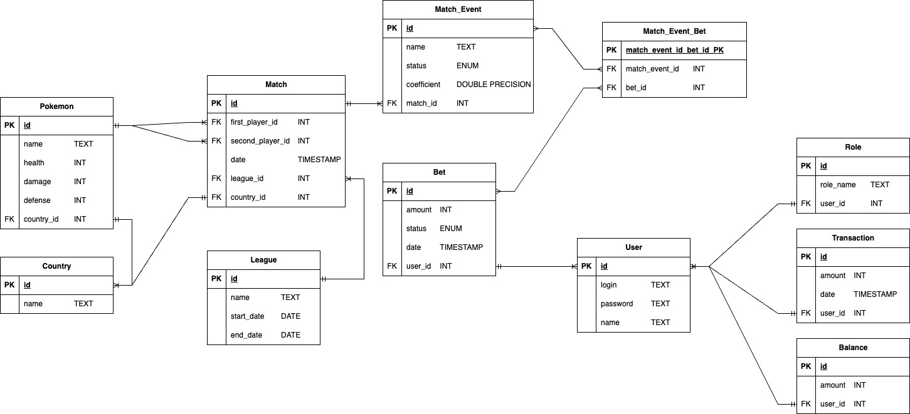

# Рефакторинг приложения

## Описание существующего приложения

### Общая информация

- Курсовой проект по ИСБД
- [Техническое задание](docs/requirements.pdf)
- [Showcase проекта](docs/showcase.pdf)
- Команда
    - Приходько Максим Александрович
    - Керпик Артём Витальевич
- Группа
    - P34121

### Предметная область

Онлайн букмекерская контора со ставками на поединки покемонов

#### Подробное описание предметной области

Букмекерская контора - веб-приложение, в котором пользователи могут
1) пополнять баланс (фантиками)
2) смотреть список доступных турниров, матчей в них.
3) выбрать матч и сделать ставку на команду/игрока (коэффициенты на победу разные, кто-то слабее, кто-то сильнее).
4) просматривать историю своих ставок
5) получать выплату с выигрышных ставок, или не получать с проигрышных

##### Тип спорта: В букмекерской конторе представлены битвы покемонов.
Имеются турниры, в каждом турнире есть несколько матчей.

##### Коэффициенты ставок:
Для каждого матча в букмекерской конторе присутствуют коэффициенты, которые определяются на основе ожидаемых шансов на победу для каждого покемона. По умолчанию у каждого матча имеется два исхода: Победа Первого, Победа Второго.

##### Типы ставок:
Пользователи могут делать различные виды ставок:
Одиночные ставки на один конкретный матч или событие.
Экспресс-ставки, где пользователь выбирает несколько событий, и для выигрыша нужно, чтобы все выбранные события завершились успешно. Коэффициенты всех событий перемножаются.

##### Результаты и их установление:
Результаты событий, на которые пользователи делали ставки, не устанавливаются автоматически. Модераторы букмекерской конторы имеют доступ к установлению результатов и закрытию ставок.

##### Роли и их функции:
Пользователь: Зарегистрированные пользователи имеют доступ к функциям букмекерской конторы, таким как просмотр списка матчей, совершение ставок и просмотр истории ставок. Они также могут пополнять баланс.
Модератор: Модераторы назначаются администраторами и имеют возможность устанавливать результаты событий, закрывать ставки.
Администратор: Администраторы имеют доступ к управлению букмекерской конторой. Они могут назначать модераторов, добавлять вручную матчи, удалять пользователей и решать другие административные задачи.

##### Система регистрации и аутентификации:
Используется система регистрации и аутентификации. Роли (Администратор и Модератор) устанавливаются через запрос к БД. По умолчанию все зарегистрированные имеют роль Пользователь.

##### Система баланса:
Каждый пользователь имеет баланс, который можно пополнять с помощью фантиков. Вместо реальной платежной системы Пользователь просто нажимает на кнопку, по которой ему выдается 1000 фантиков. Баланс используется для совершения ставок, и выигрыши или проигрыши отображаются на балансе пользователя.

##### История ставок и финансовые операции:
Пользователи могут просматривать историю своих ставок и финансовых операций, включая пополнения баланса и выплаты выигрышей.

### Сценарии использования системы:

#### 1 – Пользователь делает ставку, и Модератор её закрывает
Пользователь перешел на сайт, зарегистрировался, попал на главную страницу сайта.
Пользователь заходит в личный кабинет, чтобы пополнить баланс (нажать на кнопку, баланс пополнится на 1000 фантиков)
Пользователь заходит в список матчей. Ищет понравившиеся соревнования.
Пользователь выбирает матч, выбирает покемона, на которого хочет сделать ставку. Выбирает сумму ставки и делает её.
Модератор (уже залогинен) заходит в специальную Модер-Панель, в которой видит все текущие матчи (которые начались и ещё не были закрыты).
Выбирает матч, который кончился. Проставляет ему нужный итог, закрывает матч.
Пользователь заходит в историю ставок, видит, что его ставка – выигрышная. Видит сумму ставки, сколько выиграл, с каким итогом закончился матч.
Пользователь заходит в личный кабинет, видит, что на его балансе сумма увеличилась.

#### 2 – Добавление матча
Администратор (уже залогинен) заходит в специальную Админ-Панель, в которой может добавлять матчи.
Начинает добавление матча, необходимо выбрать:
1) Турнир, в котором проводится матч
2) Двух Покемонов, которые участвуют в этом матче
3) Коэффициенты на победу каждого из покемонов
4) Время начала матча
Администратор выбирает все эти поля, добавил матч.
Пользователи теперь могут увидеть этот матч в странице матчей и сделать на него ставку.

### Даталогическая модель

### Backend

Spring boot application stack:

- spring boot
- spring web
- spring data
- spring security
- postgresql

### Frontend

React application stack:

- vue
- bootstrap
- vuex
- vue-clie-service
- npm

## Предложения по рефакторингу

### Этап 1 (v.1)

Backend

- [ ] OpenAPI спецификация для backend (Swagger)
- [ ] Добавление логгирования (sl4j)
- [ ] Добавить инструмент для миграции БД (liquibase/flyway)

Frontend

- [ ] Визуализировать покемонов и их характеристики (сейчас вместо покемонов - абстрактные имена, без каких-либо характеристик, хотя на backend они есть)
- [ ] Миграция: vue-cli-service -> vite

### Этап 2 (v.2)

Backend

- [ ] Переехать с maven на gradle 
- [ ] Добавить пагинацию и сортировку
- [ ] Вынести всякие DTO в commons-библиотеку, для дальнейшего использования в микросервисах

Frontend

- [ ] Использовать пагинацию и сортировку с сервера
- [ ] Добавить валидацию моделей с сервера (чтобы структура DTO наверняка совпадала как на бэке, так и на фронте)

### Этап 3 (v.3)

Общее

- [ ] Написание unit-тестов
- [ ] Добавить развертывание frontend, backend и database в контейнерах в docker-compose

Backend

- [ ] Вынести работу с балансом в отдельный микросервис, общение по REST

Frontend

- [ ] Добавить рандомную картинку для каждого покемона